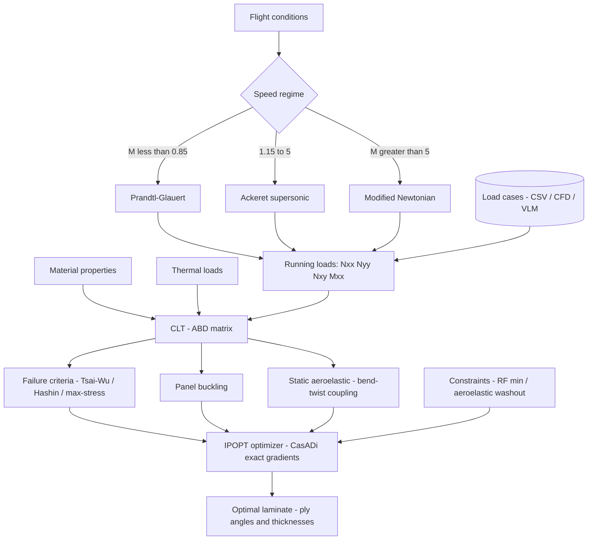

# composite_panel

A self-study Python toolkit for preliminary sizing of composite wing skin panels on high-speed airframes. I built it to teach myself Classical Laminate Theory, composite failure/buckling checks, and how those pieces connect to small engineering optimization workflows in code.

Loads can be pulled from external sources (CSV, CFD, VLM) or computed directly from flight conditions using closed-form panel pressure models.

The active running-load path uses Prandtl-Glauert for subsonic flight, Ackeret linearised theory for supersonic flight, and switches to Modified Newtonian above Mach 5.

The resulting running loads feed into Classical Laminate Theory to recover ply-level stresses, which are checked against failure criteria (Tsai-Wu, Hashin, max-stress) and a panel buckling margin. A CasADi/IPOPT gradient-based optimizer then sizes the laminate across all load cases simultaneously.




---

## Structure

```
src/composite_panel/
|-- ply.py                     --  PlyMaterial, Ply, IM7_8552, T300_5208
|-- laminate.py                --  ABD matrix, CLT response, effective moduli, alpha_lam
|-- failure.py                 --  Tsai-Wu, Tsai-Hill, Hashin, max-stress, max-strain
|-- buckling.py                --  panel buckling RF under combined Nxx/Nyy/Nxy
|-- thermal.py                 --  CTE transforms, thermal resultants, aero heating
|-- aero_loads.py              --  Prandtl-Glauert / Ackeret / Modified Newtonian pressure to running loads
|-- loads_db.py                --  LoadCase, LoadsDatabase (CSV-backed collection)
|-- trim.py                    --  flight mechanics trim (alpha, CL, q) across Mach range
|-- aeroelastic.py             --  static aeroelastic correction (Euler-Bernoulli + washout)
|-- lamination_parameters.py   --  LPs, stiffness polars, LP feasibility domain, BTC/SEC indices
+-- optimizer.py               --  minimum-mass NLP via IPOPT/CasADi (single + multicase + aeroelastic)

scripts/                               all plots written to outputs/
|-- validate_model.py                   --  run first: regression checks against 7 analytical benchmarks
+-- flight_envelope.csv                 --  reference load cases for multicase sizing examples

tests/
|-- test_basics.py
|-- test_clt.py
|-- test_failure.py
|-- test_buckling.py
+-- test_input_parsing.py

docs/
+-- optimizer.md      --  NLP formulation, CasADi implementation notes, references

notebooks/                             read in order; each builds on the previous
|-- 01_composite_panel_tutorial.ipynb       --  start here: material constants, Q-bar, ABD matrix, failure criteria, optimizer
|-- 02_tutorial_multicase_sizing.ipynb      --  multi-case NLP from a real flight envelope
|-- 03_tutorial_hypersonic_wing.ipynb       --  adiabatic wall temperature, thermal resultants, Mach 0.8-5 sizing
|-- 04_tutorial_aeroelastic_tailoring.ipynb --  D16 bend-twist coupling; strength + washout in one IPOPT solve
+-- 05_tutorial_sensitivity.ipynb           --  parametric sweeps of n_load and Mach
```

---

## Installation

```bash
pip install -e ".[dev]"
```

Core dependencies (`numpy`, `matplotlib`, `aerosandbox`) are declared in `pyproject.toml`. `aerosandbox` pulls in CasADi, which is required for the optimizer.

---

## Limitations

- This is a panel-level preliminary-analysis model, not a full wing-box structural model.
- Spanwise loads use closed-form/strip-theory assumptions and are not a substitute for a full loads process.
- The transonic regime is intentionally unsupported.
- The aeroelastic treatment is a simplified linear static model intended for intuition and trade studies.
- The `LoadsDatabase` module is a CSV-backed collection for examples and small studies, not a production data system.
- The validation here is against analytical checks and internal consistency tests; it should not be interpreted as certification-grade verification.

---

## Testing and validation

### Unit tests

```bash
pytest tests/
```

68 tests across CLT, failure criteria (Tsai-Wu, Hashin, max-stress), buckling (including bend-twist coupling detection), input parsing, and basic integration checks.

### Analytical validation

```bash
python scripts/validate_model.py
```

Checks the implementation against known analytical results across 7 blocks:

| Block | What is checked | Reference |
|---|---|---|
| 1 | IM7/8552 elastic constants and strengths vs CMH-17 B-basis | CMH-17-1F Vol. 2 Ch. 4 |
| 2 | CLT limit cases: A11 exact formula, B=0 for symmetric layups, quasi-isotropic symmetry | Jones (1999) |
| 3 | Tsai-Wu RF = 1.0 at each uniaxial failure boundary; linear scaling with load | Tsai & Wu (1971) |
| 4 | Nxx_cr matches Timoshenko closed form for [0]8; cubic h^3 scaling | Timoshenko & Gere (1961) |
| 5 | Supersonic Ackeret check at M=1.5; subsonic Prandtl-Glauert check at M=0.6 | Ackeret (1925) |
| 6 | Optimizer result satisfies the RF target at optimum |  --  |
| 7 | Physics monotonicity: mass increases with Mach and load factor; root thicker than tip |  --  |

---

## References

| Topic | Reference |
|---|---|
| CLT | Jones  --  *Mechanics of Composite Materials* (1999) |
| Tsai-Wu | Tsai & Wu  --  *J. Composite Materials* 5(1), 1971 |
| Hashin | Hashin  --  *J. Applied Mechanics* 47(2), 1980 |
| Buckling | Timoshenko & Gere  --  *Theory of Elastic Stability* (1961) Ch. 9 |
| Buckling (shear) | ESDU 02.03.11 |
| Ackeret pressure | Ackeret  --  *ZAMM* 5(1), 1925 |
| Optimizer | Kassapoglou  --  *Design and Analysis of Composite Structures* (2013) |
| Lamination parameters | Gurdal, Haftka & Hajela  --  *Design and Optimization of Laminated Composite Materials* (Wiley, 1999) Ch. 4 |
| LP feasibility domain | Miki  --  *Material design of composite laminates with required in-plane elastic properties*, ICCM-4 (1982) |
| Aeroelastic tailoring | Weisshaar  --  *Aeroelastic tailoring of forward swept composite wings*, J. Aircraft 18(8), 1981 |
